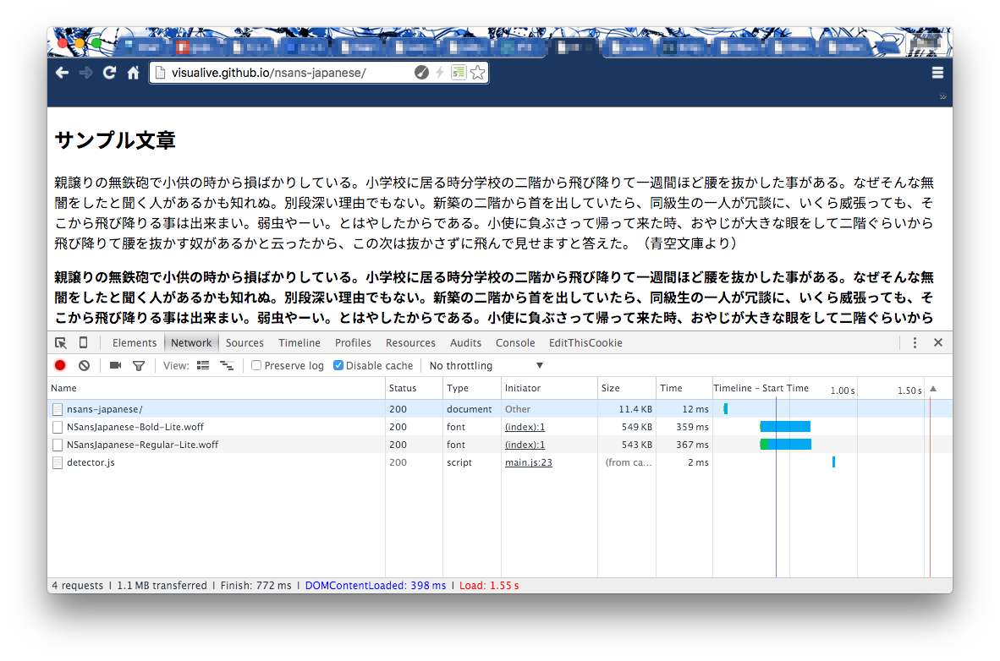
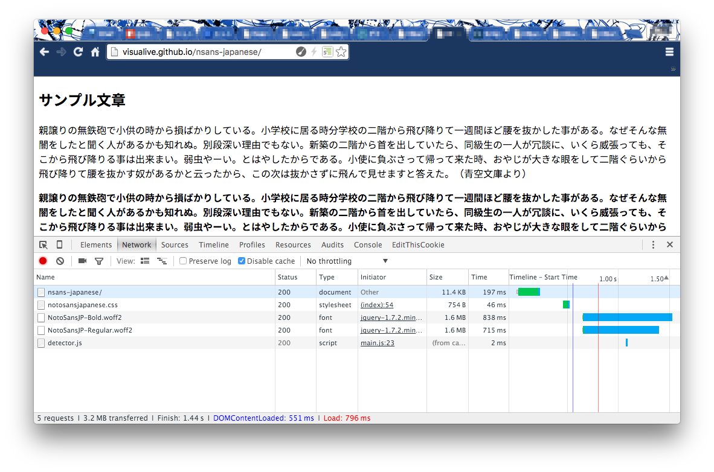

# NSansJapanese Font

Noto Sans CJK JP の Regular と Bold をサブセット化し軽量化したフォント。

[NSansJapanese Demo](http://visualive.github.io/nsans-japanese/)  

[Google API Demo](http://visualive.github.io/nsans-japanese/google-cdn.html)

## License

Licensed under the SIL Open Font License, Version 1.1.

## Change logs
* Version: 201511221100  
First Release.
